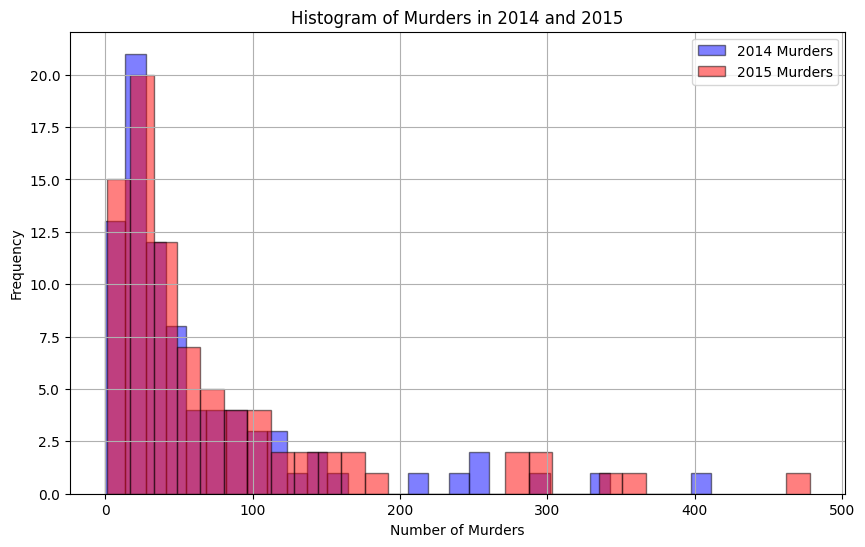
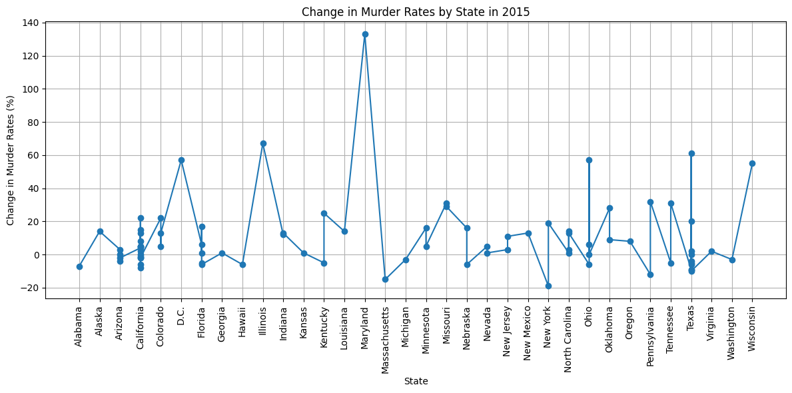

# Readme
## Youtube demo video:
https://www.youtube.com/watch?v=ilglKNsoDL8  
## Continuous Integration using Gitlab Actions of Python Data Science Project
__.devcontainer:__ It sets up a consistent development environment across different machines.  
__.github/workflows:__ It defines automated workflows for CI/CD tasks.  
__Makefile:__ It manages tasks like installing dependencies, formatting code, linting, and testing- requirements.txt.  
__requirements:__ Lists the Python packages required by the project.  
__lib.py:__ Contains all of the calculation functions for the project.  
__main.py:__ Contains the main code and functions for the project.  
__Change_in_Murder_Rates_by_State_in_2015.png:__ A line chart illustrates the percentage change in murder rates across U.S. states from the previous year.   
__Histograms_of_Murders_2014_2015.png:__ A histogram visually compares the distribution of murder counts for the years 2014 and 2015.   
__report.md:__ A markdown for the above 2 diagrams.  
__test_lib.py:__ Contains test cases for lib.py.  
__test_main.py:__ Contains test cases for main.py.  
__main.ipynb:__ A Jupyter notebook that summarize the perform descriptive statistics using Pandas.  
__README.md:__ Provides project structure, source of raw data, and data visualizations for the project.  

## Purpose of the project
This project is based on the previous 2 projects to generate continuous integration using GitHub Actions for Python Data Science Projects with real-world data. 
The raw data I used is from FiveThirtyEight contains detailed information on murder statistics in U.S. cities and states for the years 2014 and 2015.   

## Data visualization
__raw data:__ https://raw.githubusercontent.com/fivethirtyeight/data/master/murder_2016/murder_2015_final.csv   
__Description for the data:__
|       |   2014_murders |   2015_murders |    change |
|:------|---------------:|---------------:|----------:|
| count |        83      |        83      |  83       |
| mean  |        65.747  |        75.4819 |   9.73494 |
| std   |        79.0112 |        91.6843 |  21.8588  |
| min   |         0      |         1      | -19       |
| 25%   |        19.5    |        22.5    |  -3       |
| 50%   |        32      |        39      |   4       |
| 75%   |        82      |        94      |  14       |
| max   |       411      |       478      | 133       |  

__Histogram of Murders in 2014 and 2015:__
  

__Change in Murder Rates by State in 2015:__

